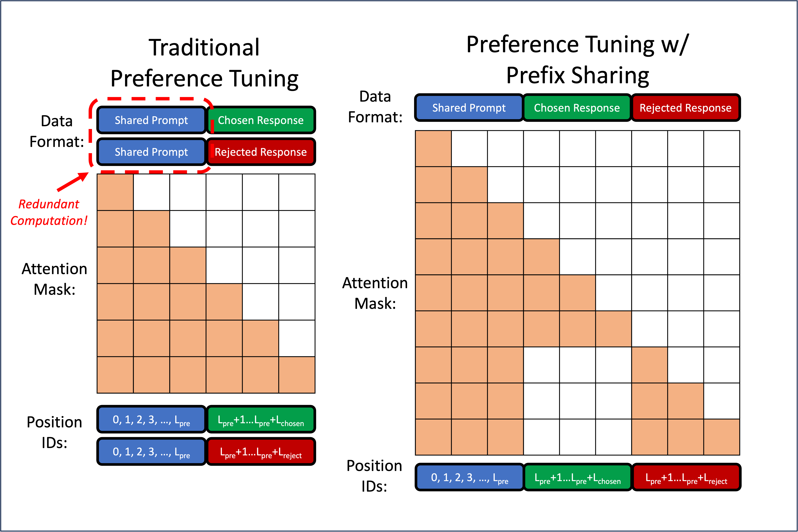

# Prefix Sharing for DPO 

Implementation of prefix sharing training for DPO with Flex Attention. 



Contains code to reproduce our work "Accelerating Direct Preference Optimization with Prefix Sharing", NeurIPS-FITML Workshop, 2024. [Paper link]

## Get Started
Installation instructions: 
- Python 3.10+
- CUDA 12.3 or above
- PyTorch 2.5.0+ (As of Sept 15th 2024, PyTorch 2.5.0 is avaiable in the [test channel](https://dev-discuss.pytorch.org/t/pytorch-2-5-release-branch-cut-for-pytorch-core-is-completed/2452/1))
- `pip install -r requirements.txt`

## Launch training
Our trainer is based on the DPO Trainer from 🤗TRL, and thus you can run training as you would for a typical DPO run. We further enable prefix sharing and sequence packing with the flags `--prefix_sharing` and `--enable_packing`. Some example commands are provided below for the [Capybara dataset](https://huggingface.co/datasets/argilla/distilabel-capybara-dpo-7k-binarized). We've implemented support for Mistral and Llama 3 models.


### Prefix sharing

For running training for `meta-llama/Meta-Llama-3-8B-Instruct` with prefix sharing: 
```
accelerate launch --config_file 'configs/zero3.yaml'  train_dpo.py  --dataset_name=argilla/distilabel-capybara-dpo-7k-binarized --model_name_or_path=meta-llama/Meta-Llama-3-8B-Instruct --per_device_train_batch_size 2 --learning_rate 1e-6 --gradient_accumulation_steps 1 --logging_steps 10 --eval_steps 500 --warmup_steps 20 --bf16 --logging_first_step --no_remove_unused_columns --output_dir --max_prompt_length 2180 --max_length 2842 --gradient_checkpointing True --save_strategy no --dataset_test_split test --dataset_train_split train --num_train_epochs 1 --dataloader_num_workers 4 --attn_implementation flex_attention --prefix_sharing 
```
Optionally, add reporting flags `--report_to wandb --run_name <my_run>` for WandB, etc

NOTE: The current training config assumes training on a 8xA100 or a 8xH100 node. Tweak as needed for your setup. 

### Prefix sharing with sequence packing

Run:
```
accelerate launch --config_file 'configs/zero3.yaml'  train_dpo.py  --dataset_name=argilla/distilabel-capybara-dpo-7k-binarized --model_name_or_path=meta-llama/Meta-Llama-3-8B-Instruct --per_device_train_batch_size 1 --learning_rate 1e-6 --gradient_accumulation_steps 1 --logging_steps 10 --eval_steps 500 --warmup_steps 20 --bf16 --logging_first_step --no_remove_unused_columns --output_dir outputs --max_prompt_length 2180 --max_length 2842 --gradient_checkpointing True --save_strategy no --dataset_test_split test --dataset_train_split train --num_train_epochs 1 --dataloader_num_workers 4 --attn_implementation flex_attention --prefix_sharing --enable_packing --packing_length 7936
```

NOTE: We calculate the "packing length" based on statistics for prefix shared inputs. In the case of Capybara, we choose a packing length of 3968 (calculated as $1.1 \times 95^{th}$ percentile of sequence lengths) and multiply by desired batch size per device (2) to get 7936. Internally, we pad all sequences (including packed sequences) to a multiple of 128 to work nicely with flex attention. 

To reproduce the results from our paper for Capybara, you use run: `bash benchmark/run_capybara.sh`

## Folder structure
`data`: Data processing and dataloading related files, including chat templating, sampler for sequence packing, patches for dataloading, etc  
`modeling`: Contains custom attention masks and model patches to use flex attention instead of flash attention.   
`train_dpo.py`: Main entrypoint.   
`trainer.py`: Contains a modified `DPOTrainer` to work with prefix shared inputs (with optional sequence packing). We mainly customize the preprocessing (to form prefix shared inputs), the forward pass (with a custom block mask per input for Flex Attention) and the log probability computation.  

## Acknowledgements

Our code is based off of 🤗TRL - https://github.com/huggingface/trl. The sampler implementation is from Axolotl https://github.com/axolotl-ai-cloud/axolotl which is a more distributed training friendly version of https://github.com/imoneoi/multipack_sampler
We also make use of FlexAttention 

## Citation

If you find our work useful, please cite 

```
@inproceedings{
wang2024accelerating,
title={Accelerating Direct Preference Optimization with Prefix Sharing},
author={Franklin Wang and Sumanth Hegde},
booktitle={NeurIPS 2024 Workshop on Fine-Tuning in Modern Machine Learning: Principles and Scalability},
year={2024},
url={https://openreview.net/forum?id=d4dRhZiTdm}
}
```

